---
lab:
  title: 'ラボ 01: Vision Studioでイメージ検索を行う'
  module: Module02 Computer Vision
---

# ラボ 01 - Vision Studioでイメージ分析を行う

## ラボ概要

Azure AI Visionには、画像の内容やコンテキストを分析して情報を抽出する機能があります。Azure AI Vision Studioには組み込みの分析機能が用意されており、画像分析の機能を簡単に検証することができます。

このラボではVision Studioを使用して画像に対するキャプション生成や物体検出の機能を確認します。

## 推定時間 : 40 分

## ラボ環境の起動

このラボでは[Skillable](https://alh.learnondemand.net/)にて以下のラボを起動して実施してください。

​	**Analyze images in Vision Studio**

​	 AI-900T00-A Microsoft Azure AI Fundamentals [Cloud Slice Provided], Learning Path 02 (CSS)

## タスク1 : Azure AI Servicesリソースの作成

このタスクでは、Azure AI Visionを使用するためにAzure AI Servicesの**マルチサービスリソース**を作成します。

1. [**Azure portal**](https://portal.azure.com)にサインインします。

    >**注:** ツアーが開始された（"Microsoft Azureへようこそ"等の表示）場合は、"キャンセル"をクリックしてAzure Portalへ移動します。

1. ポータルメニューで **+リソースの作成** ボタンをクリックし、**リソースの作成** 画面に移動します。

1. 検索ボックスに **Azure AI Services** と入力して、表示された **Azure AI Services** の作成ボタンから **Azure AI Services** を選択します。

    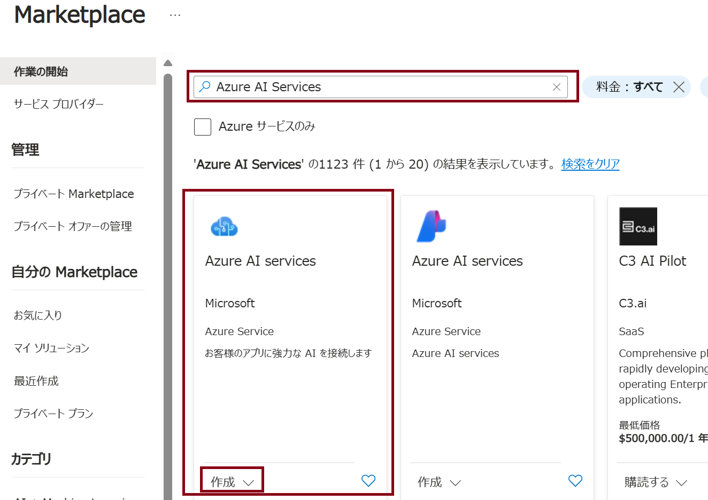

1. **Create Azure AI services** の画面が表示されたら、基本タブにて以下のパラメーターを設定します。

    | パラメーター                            | 値                                                           |
    | --------------------------------------- | ------------------------------------------------------------ |
    | サブスクリプション                      | ※既定値を使用                                                |
    | リソースグループ                        | Resource Group1（ドロップダウンリストから選択）              |
    | リージョン                              | West US                                                      |
    | 名前                                    | <任意の文字列（お名前等）>-yyyymmmdd-vision ※例：ftamaki-20240101-vision |
    | 価格レベル                              | Standard S0                                                  |
    | このボックスをオンにすることにより..... | チェックボックスをオン                                       |

1. **[確認と作成]** をクリックして検証の完了を待ちます。検証が完了したら、**[作成]** のボタンをクリックしてリソースを作成します。

    ※検証が完了しない、もしくは失敗する場合は今回の内容では名前が原因の可能性があります。基本タブに戻り、名前を別の値に変更してください。

1. リソースの作成が完了したら、 **[リソースへ移動]** をクリックして、作成した **Azure AI services multi-service account** の画面へ移動します。
## タスク 2 : Vision Studioへのアクセス

ひとつ前のタスクで作成したAzure AI services multi-service accountをVision Studioに接続し、サービスへアクセスします。 

1. ブラウザでAzure Portalとは別のタブを使用して、[Vision Studio](https://portal.vision.cognitive.azure.com/)にアクセスします。 

1. 移動したVision Studioのページで右上の **Sign in** をクリックしてサインインします。

    ※ポップアップが表示された場合はそのまま閉じて進めてください

    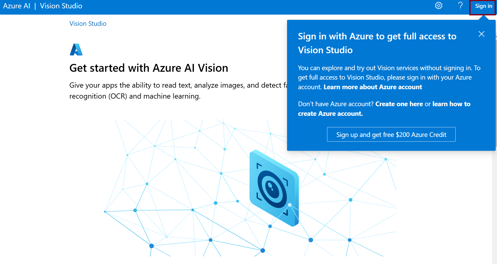

1. 画面中央の **[View all resources]** をクリックします。

    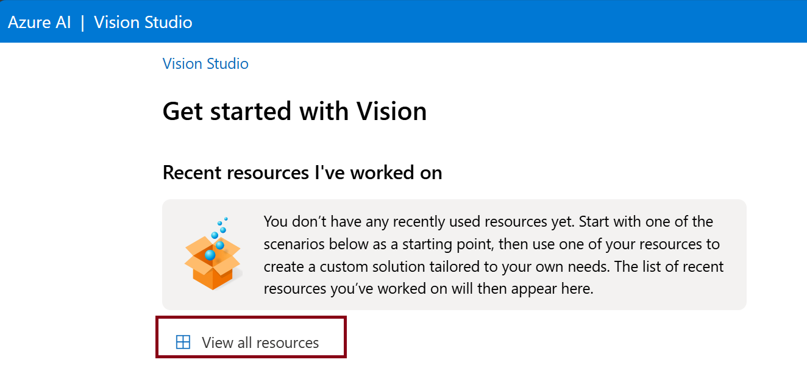

1. 表示された一覧の中から先ほどのタスクで作成したリソースを選択します。

    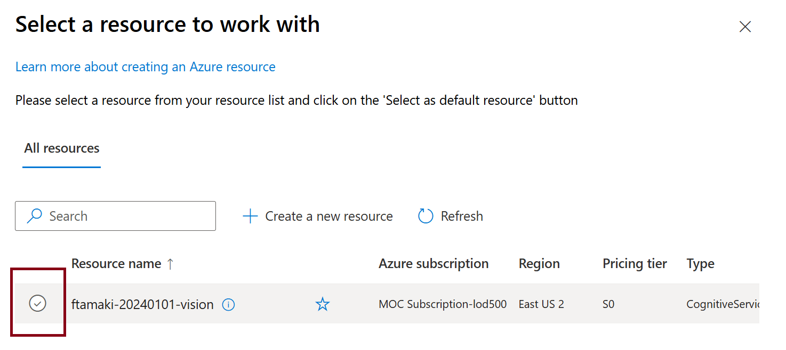

1. 選択後は画面下部の **[Select as default resource]** をクリックします。

1. ボタンをクリックした後は右上の×ボタンをクリックして **Select a resource to work with** の画面を閉じます。

## タスク 3 : イメージのキャプションを作成する

先ほどリソースを関連付けたVision Studio上で画像のキャプションを作成していきます。

1. Vision Studioのトップ画面から **[Add captions to images]** のタイルをクリックします。

   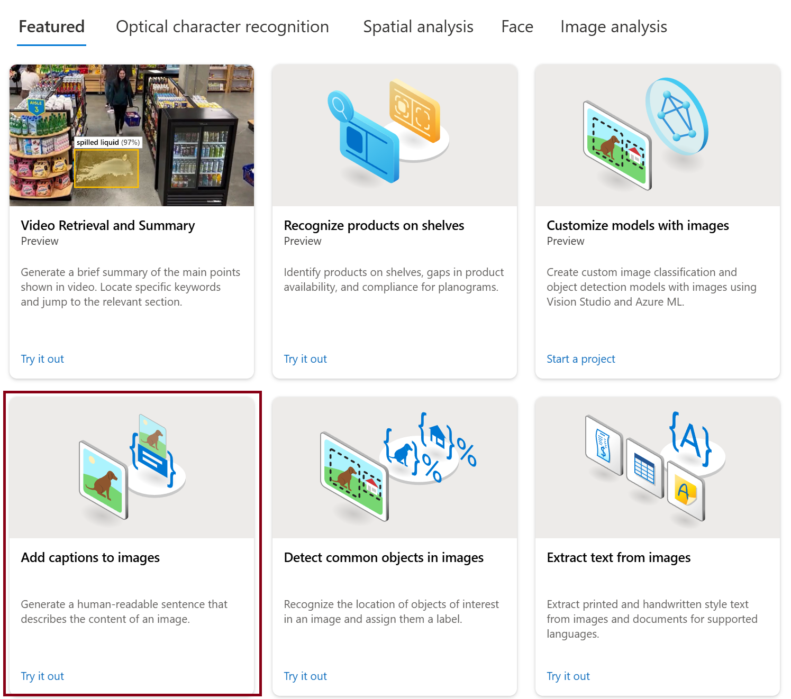

2. **[Try it out]** の項目に表示されているチェックボックスを **オン（チェックを入れる）** にします。

3. 以下のリンクを使用してファイルをダウンロードします。ダウンロードしたzipファイルは展開してから使用します。

   [https://aka.ms/mslearn-images-for-analysis](https://aka.ms/mslearn-images-for-analysis  )

   ※zipファイルが展開されていない場合はファイルアップロード時に選択することができません

4. **[Browse for a file]** をクリックして、先ほどダウンロードしたファイルの中から **[store-camera-1.jpg]** を選択します。

   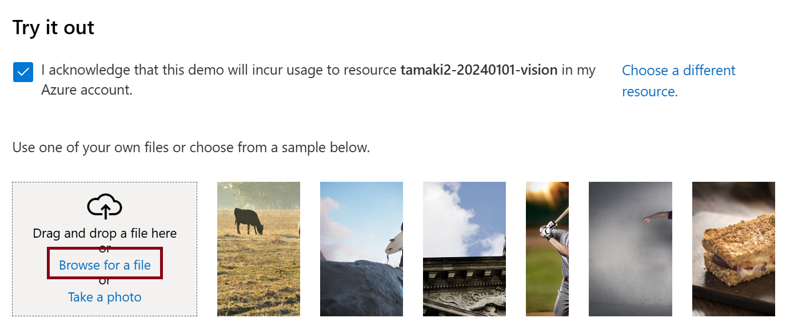

5. **[Detected attributes]** の項目を確認して、画像に対して生成されたキャプションを確認します。

   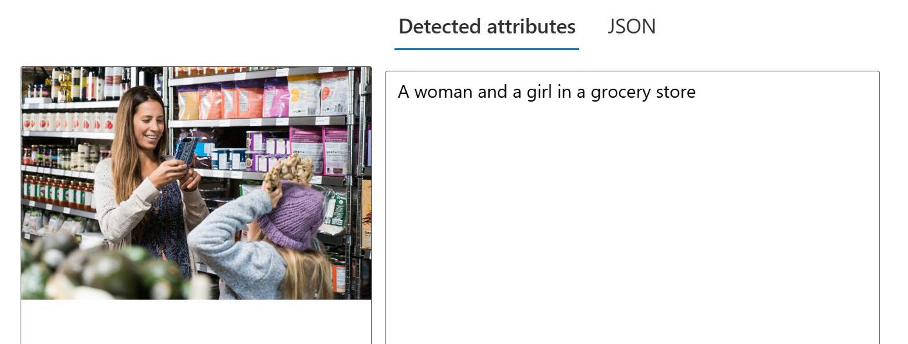

6. 同様の手順でstore-camera-2.jpg、store-camera-3.jpg、store-camera-4.jpgをアップロードして、同じく生成されたキャプションの内容を確認します。

7. 別の方法でキャプションを生成するために、一度 **Add captions to images** の画面を閉じます。

   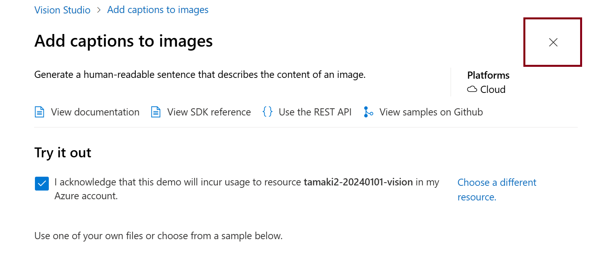

8. Vision Studioのトップ画面から **[Add dense captions to images]** のタイルをクリックします。

9. **[Try it out]** の項目に表示されているチェックボックスが **オン（チェックを入れる）** になっていることを確認します。

10. **[Browse for a file]** をクリックして、先ほどと同様にダウンロードしたファイルの中から **[store-camera-1.jpg]** を選択します。

11. **[Detected attributes]** の項目を確認して、画像に対して生成されたキャプションを確認します。先ほどとは異なり、画像内の複数項目を認識してキャプションが生成されています。

    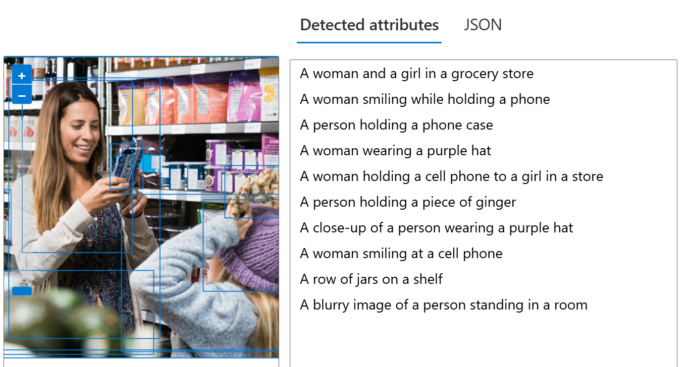

12. 同様の手順でstore-camera-2.jpg、store-camera-3.jpg、store-camera-4.jpgをアップロードして、同じく生成されたキャプションの内容を確認します。

13. **Add dense captions to images** の画面を閉じます。

## タスク 4 : イメージのタグ付け

このタスクでは画像に対してタグ付けを行います。画像内の景色や物体を認識して、タグを生成します。

1. Vision Studioのトップ画面から**[Extract common tags from images]** のタイルをクリックします。

2. **[Try it out]** の項目に表示されているチェックボックスが **オン（チェックを入れる）** になっていることを確認します。

   ※カスタムモデルの使用に伴い申請が必要と警告が表示されますが、そのまま進めることができます。

3. **[Browse for a file]** をクリックして、先ほどのタスクと同様にダウンロードしたファイルの中から **[store-camera-1.jpg]** を選択します。

4. **[Detected attributes]** の項目を確認して、画像に対して生成されたタグを確認します。画像内の含まれている要素をタグ付けしていることが確認できます。

   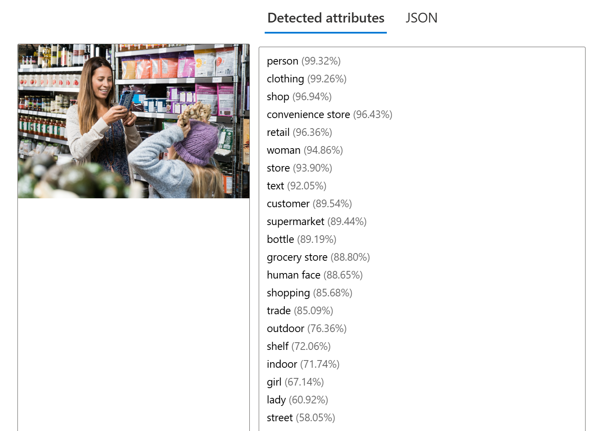

5. 同様の手順でstore-camera-2.jpg、store-camera-3.jpg、store-camera-4.jpgをアップロードして、同じく生成されたタグの内容を確認します。

6. **Extract common tags from images** の画面を閉じます。

## タスク 5 : イメージの物体検出

このタスクではイメージに含まれる物体の検出を行う機能をテストします。

1. Vision Studioのトップ画面から**[Detect common object in images]** のタイルをクリックします。

2. **[Try it out]** の項目に表示されているチェックボックスが **オン（チェックを入れる）** になっていることを確認します。

   ※カスタムモデルの使用に伴い申請が必要と警告が表示されますが、そのまま進めることができます。

3. **[Browse for a file]** をクリックして、先ほどのタスクと同様にダウンロードしたファイルの中から **[store-camera-1.jpg]** を選択します。

4. **[Detected attributes]** の項目を確認して、画像内に検出された物体の情報を確認します。

   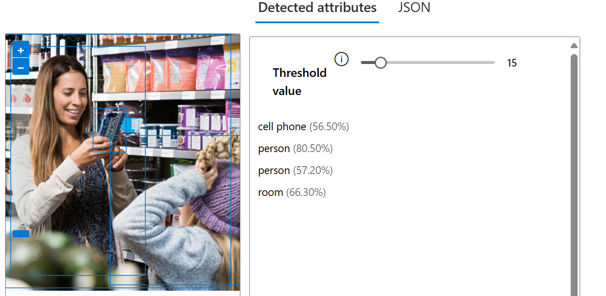

5. **[Threshold value]** のスライダーを動かして値を変更することにより、検出確度の閾値を調整することができます。

6. 同様の手順でstore-camera-2.jpg、store-camera-3.jpg、store-camera-4.jpgをアップロードして、同じく生成されたタグの内容を確認します。

7. **Detect common object in images** の画面を閉じます。

以上でVision Studioを使用したラボは完了です！
