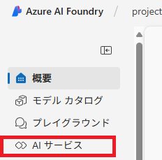
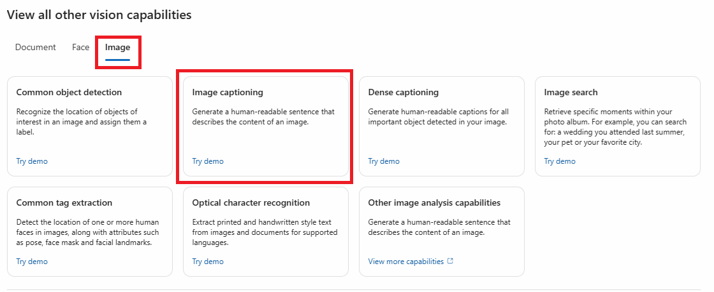
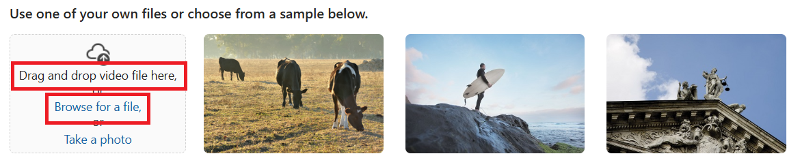
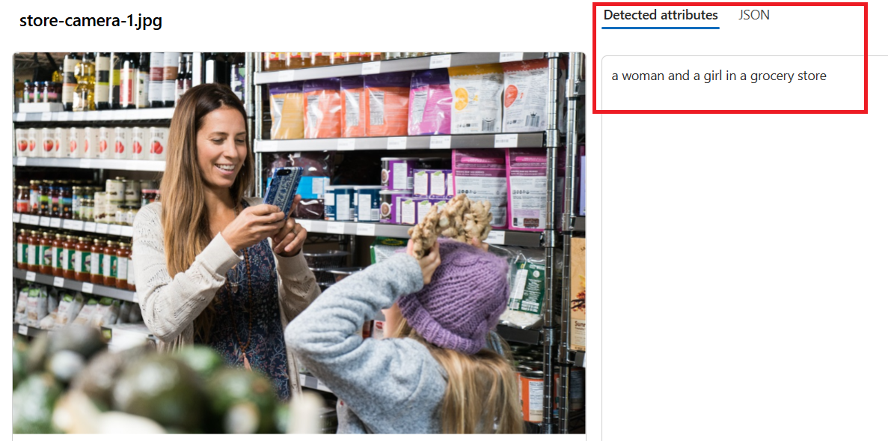
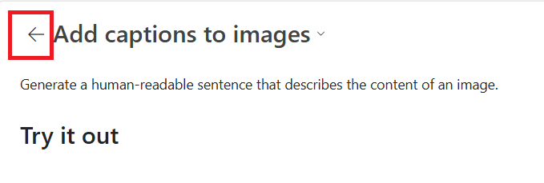
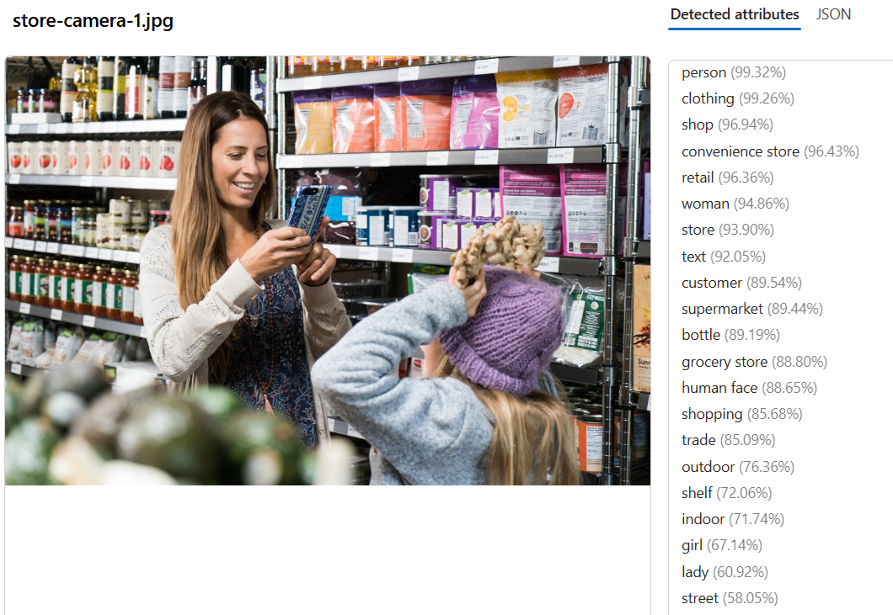
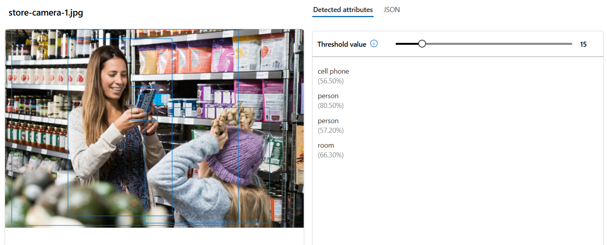

---
lab:
  title: 'ラボ 01: Visionを使用してイメージ分析を行う'
  module: Module02 Computer Vision
---

# ラボ 01 - Vision を使用してイメージ分析を行う

## ラボ概要

Azure AI Visionには、画像の内容やコンテキストを分析して情報を抽出する機能があります。Microsoft AzureにおけるAIサービスを統合的に管理するAzure AI Foundry Portalを使用して、Azure AI Visionの組み込みの分析機能による画像分析を簡単に検証することができます。

このラボではAzure AI Foundry Portalを使用して画像に対するキャプション生成や物体検出の機能を確認します。

## 推定時間 : 40 分

## ラボ環境の起動

このラボでは[Skillable](https://alh.learnondemand.net/)にて以下のラボを起動して実施してください。

​	**Analyze images in Azure AI Foundry portal (JA) / Azure AI Foundry ポータルで画像を分析する **

​	 AI-900T00-A Microsoft Azure AI Fundamentals [Cloud Slice Provided] JAPANESE, Learning Path 02 (CSS)

## タスク1 : プロジェクトの作成

このタスクでは、Azure AI Visionを使用するために**プロジェクト** を作成します。 Azure AI Foundry では、プロジェクトを作業の整理を行うためのコンテナーとして使用します。

1. Skillableのラボウィンドウで確認、取得したアカウント情報を使用して [**Azure AI Foundry Portal**](https://ai.azure.com/managementCenter/allResources)にサインインします。

    >**注:** ツアーやチュートリアルが表示される場合は、"キャンセル"もしくはポップアップの×ボタンをクリックして閉じます。

1. ポータルメニューで **新規作成** ボタンをクリックし、**プロジェクトの作成** 画面に移動します。

1.  **プロジェクトの作成** 画面では、 **AIハブリソース** を選択して **次へ** をクリックします。

    

1. **新しいプロジェクトの作成** の画面が表示されたら、高度なオプションを展開して以下のパラメーターを設定します。

    | パラメーター       | 値                                                           |
    | ------------------ | ------------------------------------------------------------ |
    | プロジェクト名     | project[アカウント名に含まれている数字8桁] 例：アカウント名=LabUser-12345678@LODSPRODMCA.onmicrosoft.com であれば**project12345678** |
    | ハブ               | 既定値（新規作成）                                           |
    | サブスクリプション | 既定値                                                       |
    | リソースグループ   | 既定値（新規作成）                                           |
    | リージョン         | East US, France Central, Korea Central, West Europe, West USのいずれかを選択 |

1. **[作成]** をクリックしてプロジェクトの作成を開始します。

    ※プロジェクトの作成には時間を要する場合があります。概ね3-5分程度で作成が完了します。

1. プロジェクトの作成が完了すると、 **Azure AI Foundry Portal** へ強制的に遷移します。

1. Azure AI Foundry Portalの左側に表示されるメニューから **AIサービス** を選択します。 

    

1. 移動した **Azure AI サービス** のページで **AI機能を使用してソリューションを活性化する** のセクションから **Visionとドキュメント** を選択します。

    

1. **Vision + Document** の画面が表示され、Visionの機能をテストすることが可能となっていることが確認できます。

    

## タスク 2 : イメージのキャプションを作成する

先ほど移動したVision + Documentの画面から画像のキャプションを作成していきます。

1. **View all other vision capabilities** セクションにて、 **Image** タブに切り替えて  **[Image captioning]** のタイルをクリックします。

   

   

1. 以下のリンクを使用してファイルをダウンロードします。ダウンロードしたzipファイルは展開してから使用します。

   [https://aka.ms/mslearn-images-for-analysis](https://aka.ms/mslearn-images-for-analysis  )

   ※zipファイルが展開されていない場合はファイルアップロード時に選択することができません

1. **[Browse for a file]** をクリックして、先ほどダウンロードしたファイルの中から **[store-camera-1.jpg]** を選択します。
   ※ドラッグアンドドロップで追加することも可能です

   

1. **[Detected attributes]** の項目を確認して、画像に対して生成されたキャプションを確認します。

   

1. 同様の手順でstore-camera-2.jpg、store-camera-3.jpg、store-camera-4.jpgをアップロードして、同じく生成されたキャプションの内容を確認します。

1. 別の方法でキャプションを生成するために、ページ上部の **左矢印** をクリックして **Vision + Document** の画面に戻ります。

   

1. Vision + Documentの画面から先ほどと同様に**View all other vision capabilities** セクションにて、 **Image** タブに切り替えて **[Dense captioning]** のタイルをクリックします。

1. **[Browse for a file]** をクリックして、先ほどと同様にダウンロードしたファイルの中から **[store-camera-1.jpg]** を選択します。

1. **[Detected attributes]** の項目を確認して、画像に対して生成されたキャプションを確認します。先ほどとは異なり、画像内の複数項目を認識してキャプションが生成されています。

    

1. 同様の手順でstore-camera-2.jpg、store-camera-3.jpg、store-camera-4.jpgをアップロードして、同じく生成されたキャプションの内容を確認します。

1. ページ上部の **左矢印** をクリックして **Vision + Document** の画面に戻ります。

## タスク 3 : イメージのタグ付け

このタスクでは画像に対してタグ付けを行います。画像内の景色や物体を認識して、タグを生成します。

1. Vision + Documentの画面から先ほどと同様に**View all other vision capabilities** セクションにて、 **Image** タブに切り替えて **[Common tag extraction]** のタイルをクリックします。

3. **[Browse for a file]** をクリックして、先ほどのタスクと同様にダウンロードしたファイルの中から **[store-camera-1.jpg]** を選択します。

4. **[Detected attributes]** の項目を確認して、画像に対して生成されたタグを確認します。画像内の含まれている要素をタグ付けしていることが確認できます。

   

5. 同様の手順でstore-camera-2.jpg、store-camera-3.jpg、store-camera-4.jpgをアップロードして、同じく生成されたタグの内容を確認します。

6. ページ上部の **左矢印** をクリックして **Vision + Document** の画面に戻ります。

## タスク 4 : イメージの物体検出

このタスクではイメージに含まれる物体の検出を行う機能をテストします。

1. Vision + Documentの画面から先ほどと同様に**View all other vision capabilities** セクションにて、 **Image** タブに切り替えて **[Common object detection]** のタイルをクリックします。

3. **[Browse for a file]** をクリックして、先ほどのタスクと同様にダウンロードしたファイルの中から **[store-camera-1.jpg]** を選択します。

4. **[Detected attributes]** の項目を確認して、画像内に検出された物体の情報を確認します。

   

5. **[Threshold value]** のスライダーを動かして値を変更することにより、検出確度の閾値を調整することができます。

5. 同様の手順でstore-camera-2.jpg、store-camera-3.jpg、store-camera-4.jpgをアップロードして、同じく生成されたタグの内容を確認します。

以上でAzure AI Vision に関するテストのラボは完了です！
