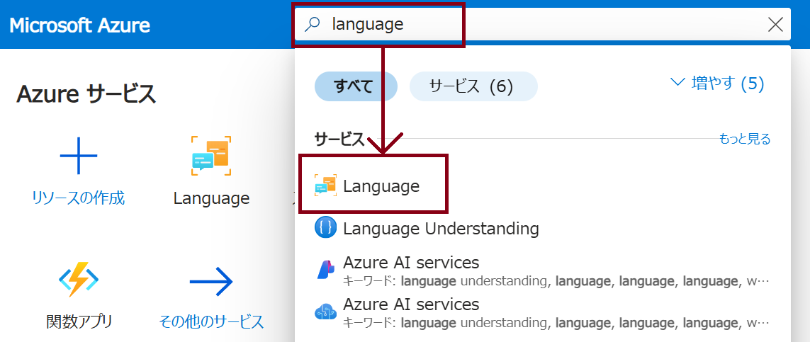
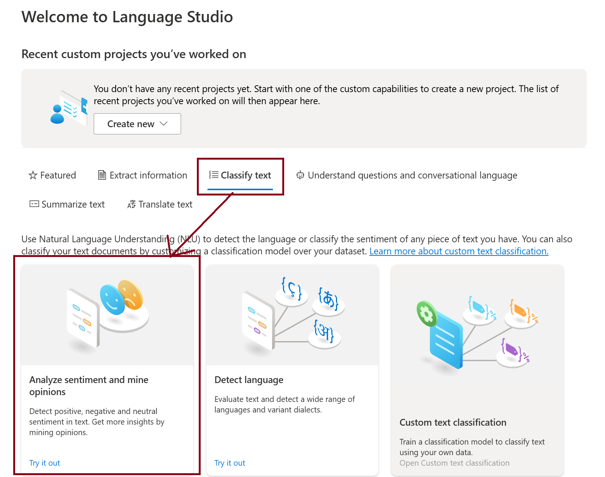
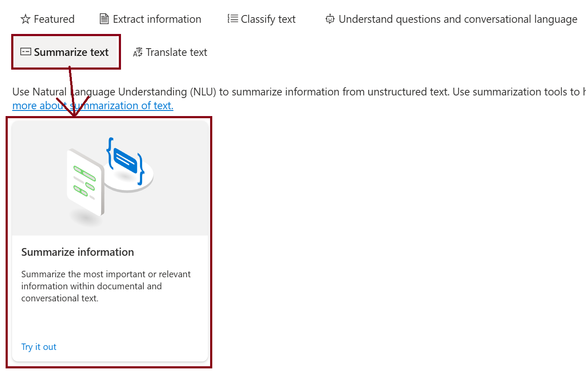

---
lab:
  title: 'ラボ 02: Language Studio を使用してテキストを分析する'
  module: Module03 Natural Language Processing
---

# ラボ 02 - Language Studio を使用してテキストを分析する

## ラボ概要

Azure AI Servicesには自然言語処理(Natural Language Processing)を実行するソリューションが存在しています。Azure AI Language Serviceにはテキスト分析や自然言語処理の機能が含まれおり、テキスト内のキーフレーズ識別や、感情に基づいたテキストの分類を実行することが可能です。

このラボではLanguage Studioを使用してテキストに対する自然言語分析の機能を確認します。

## 推定時間 : 30 分

## ラボ環境の起動

このラボでは[Skillable](https://alh.learnondemand.net/)にて以下のラボを起動して実施してください。

​	**Analyze text with Language Studio**

​	AI-900T00-A Microsoft Azure AI Fundamentals [Cloud Slice Provided], Learning Path 03 (CSS)

## タスク1 : Languageリソースの作成

このタスクでは、自然言語機能を使用するために **Language** リソースを作成します。

1. Skillableのラボウィンドウで確認、取得したアカウント情報を使用して [**Azure portal**](https://portal.azure.com)にサインインします。

    >**注:** ツアーが開始された（"Microsoft Azureへようこそ"等の表示）場合は、"キャンセル"をクリックしてAzure Portalへ移動します。

1. 画面上部に表示されている検索ボックスに **[Language]** と入力して、表示された **Language** サービスを選択します。

    

1. **[Azure AI services | 言語サービス]** の画面が表示されたら、 **[+作成]** をクリックして作成画面へ移動します。

1. **[追加機能の選択]** 画面が表示されますが、そのまま画面下部の **[リソースの作成を続行する]** をクリックします。

1. **[言語の作成]** 画面にて、以下のパラメーターを設定してリソースを作成します。

    | パラメーター                        | 値                                                           |
    | ----------------------------------- | ------------------------------------------------------------ |
    | サブスクリプション                  | ※既定値を使用                                                |
    | リソースグループ                    | Resource Group1（ドロップダウンリストから選択）              |
    | リージョン                          | West US                                                      |
    | 名前                                | <任意の文字列（お名前等）>-yyyymmmdd-lang<br />※例：ftamaki-20240101-lang |
    | 価格レベル                          | Free F0<br />※Freeが選択できない場合は"S"を選択              |
    | このボックスをオンにすることで..... | チェックボックスをオン                                       |

1. **[確認と作成]** をクリックして検証の完了を待ちます。検証が完了したら、**[作成]** のボタンをクリックしてリソースを作成します。

    ※検証が完了しない、もしくは失敗する場合は今回の内容では名前が原因の可能性があります。基本タブに戻り、名前を別の値に変更してください。

1. リソースの作成が完了したら、 **[リソースに移動]** をクリックして、作成した **Language** の画面へ移動します。
## タスク 2 : Language Studioへのアクセス

ひとつ前のタスクで作成したAzure AI services multi-service accountをVision Studioに接続し、サービスへアクセスします。 

1. ブラウザでAzure Portalとは別のタブを使用して、[Language Studio](https://language.cognitive.azure.com)にアクセスします。 

1. 移動したVision Studioのページで右上の **Sign in** をクリックしてサインインします。

    再度アカウント情報が求められた場合は、Azure Portalへのサインインに使用したSkillable発行のアカウント情報を入力します。

    ※Welcome～のポップアップが表示された場合はそのまま閉じて進めてください

1. リソース選択のポップアップは閉じずに以下の項目を設定します。設定が完了したら **[Done]** をクリックします。

    | パラメーター       | 値                                                           |
    | ------------------ | ------------------------------------------------------------ |
    | Azure directory    | ※既定値                                                      |
    | Azure subscription | ※既定値（ドロップダウンリストから選択）                      |
    | Resource Type      | Language                                                     |
    | Resource Name      | <任意の文字列（お名前等）>-yyyymmmdd-lang<br />※前のタスクで設定した名前 |

## タスク 3 : テキスト感情分析

このタスクではLanguage Studio上でテキスト感情(Sentiment)分析を実行します。顧客からのレビューに対してのポジティブ/ネガティブな意見を分類していきます。

1. Language Studioのトップ画面から **[Classify text]** タブを選択し、 **[Analyze sentiment and mine opinions]** のタイルをクリックします。

   

2. 次のパラメーターを指定します。

   | パラメーター                                                 | 値                                                           |
   | ------------------------------------------------------------ | ------------------------------------------------------------ |
   | Select text language                                         | Japanese                                                     |
   | Select your Azure resource                                   | ※既定値                                                      |
   | Enter your own text, upload a file, or use one of our sample texts | このホテルは1950年代からある古い建物で、部屋の設備は平均的なものだが一部は交換する必要がありました。インターネットが使用できず、帰国のためのフライトのチェックインをするためにホテルのオフィスの一室に行かなければなりませんでした。ウェブサイトには大英博物館の近くと書かれていましたが、徒歩で行くには遠すぎます。 |

3. **[I acknowledge that running this demo.....]** のチェックをオンにします。 

4. **[Run]** ボタンをクリックして、感情分析を実行します。

5. **[Examine the results]** の項目を確認します。テキスト全体に対する感情分析と、文節ごとの感情分析が表示されますが、今回は批判的な内容がテキスト中に多く含まれるため、 **[NEGATIVE]** の値が高く検出されます。

6. テキストの内容を以下のように書き換えて再度分析を実行します。

   ```text
   清潔な部屋、良いサービス、バッキンガム宮殿やウェストミンスター寺院の近くという素晴らしい立地など、私たちはこのホテルでのステイを心から楽しむことができました。中庭はとても静かで、同行者と一緒にインド料理レストランにも行き、西海岸特有の海鮮を楽しみました。部屋にはキッチン、ラウンジ、寝室、そして広大なバスルームが備わっておりとても快適でした。おすすめできるホテルです。
   ```

7. **[Run]** ボタンをクリックして、書き換えたテキストに対する感情分析を実行します。

8. **[Examine the results]** の項目を確認します。今回は好意的な内容がテキスト中に多く含まれるため、先ほどとは異なり **[POSITIVE]** の値が高く検出されます。

9. **Analyze sentiment and mine opinions** の画面を閉じます。

## タスク 4 : テキストの要約

このタスクでは入力されたテキストに対する要約を行います。

1. Language Studioのトップ画面から **[Summerize text]** タブを選択し、 **[Summerize information]** のタイルをクリックします。

   

2. 次のパラメーターを指定します。

   | パラメーター                                                 | 値                                                           |
   | ------------------------------------------------------------ | ------------------------------------------------------------ |
   | Select text language                                         | Japanese                                                     |
   | Select your Azure resource                                   | ※既定値                                                      |
   | Enter number of sentences in summary (max 20)                | 3                                                            |
   | Specify your summarization interest (preview)                | 設定なし（入力しない）                                       |
   | Enter your own text, upload a file, or use one of our sample texts | プロンプトエンジニアリング（英: prompt engineering）は、主に「テキストからテキスト」型言語モデルとのコミュニケーションで使用され、生成的人工知能（生成AI）モデルが解釈し、理解できるように指示文章を構造化する過程である。プロンプト・エンジニアリングは、「プロンプトから一時的に学習するモデルの能力」として定義されるコンテキスト内学習（in-context learning）によって可能となる。コンテキスト内学習の能力は、大規模言語モデル（LLM）の創発的能力である。<br />プロンプト（prompt）とは、人工知能（AI）が実行すべきタスクを記述した自然言語によるテキスト（文章）のことである。「テキストからテキスト」モデルのプロンプトは、「フェルマーの小定理とは何か」といったクエリ（問い合わせ）、「落ち葉についての詩を書け」といった命令短い意見文（たとえば、「冗長すぎる」、「形式的すぎる」、「言い直せ」、「この言葉を略せ」など）、またはコンテキスト（文脈）、指示[7]、入力データを含む長い文とすることができる。プロンプト・エンジニアリングには、クエリの言い回し、様式の指定[6]、関連するコンテキストの提供、または「フランス語のネイティブスピーカーのように行動する」といったAIへの役割の割り当てが含まれることがある。プロンプト・エンジニアリングは、「maison→家、chat→猫、chien→」（予想される答えは「犬」）のように、モデルが学習するための少数の例を含む単一のプロンプトで構成されることもあり、これは少数ショット学習（few-shot learning）と呼ばれるアプローチである。<br />「テキストから画像」へ、あるいは「テキストから音声」へ変換するモデルとコミュニケーションする場合、典型的なプロンプトは、『馬に乗る宇宙飛行士の高品質な写真』や『有機的なサンプルを使ったLo-Fiなスローテンポのエレクトロ・チル』など、希望する出力の説明である。<br />「テキストから画像」モデルのプロンプトは、希望する主題、様式、配置、明暗、美的感覚を実現するために、単語を追加、削除、強調、並び替えを含むことがある。 |

3. **[I acknowledge that running this demo.....]** のチェックをオンにします。 

4. **[Run]** ボタンをクリックして、要約を実行します。

5. **[Examine the results]** の項目を確認します。テキストの要約結果を確認することができ、指定した数（今回は3つ）にまとめられた形で要約されています。

6. **Summerize information** の画面を閉じます。


以上でLanguage Studioを使用したラボは完了です！
