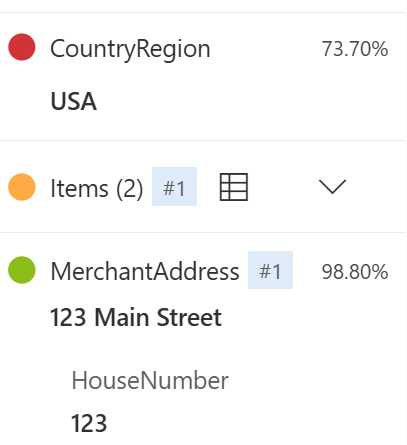

---
lab:
  title: 'ラボ 03: Extract form data in Document Intelligence Studio'
  module: Module04 Knowledge Mining
---

# ラボ 03 - Document Intelligence Studio を使用してドキュメントを分析する

## ラボ概要

Azure AI Document Intelligence は、フォームやドキュメントから情報を分析して抽出し、フィールド名とデータを識別できます。

このラボではレシートに記載された内容をDocument Intelligenceのモデルを使用して分析します。

## 推定時間 : 40 分

## ラボ環境の起動

このラボでは[Skillable](https://alh.learnondemand.net/)にて以下のラボを起動して実施してください。

​	**Extract form data in Document Intelligence Studio**

​	AI-900T00-A Microsoft Azure AI Fundamentals [Cloud Slice Provided], Learning Path 04 (CSS)

## タスク1 : ドキュメントインテリジェンスリソースの作成

このタスクでは、Document Intelligence Studioにアクセスし、ドキュメントインテリジェンスリソースを作成します。

1. ブラウザを使用して[Document Intelligence Studio](https://documentintelligence.ai.azure.com/studio)にアクセスします。

1. 画面右上に表示されているアイコンをクリックしてサインインします。

    Skillableから発行されたアカウントを使用します。起動したSkillableのラボウィンドウ **[Resource]** タブから確認可能です。

    

1. サインインが完了したら、画面右上の **[歯車]** アイコンをクリックし、[Settings]の画面に移動します。 **[Resource]** タブに切り替えて、 **[+Create a new Resource]** をクリックします。

    

1. **[Create new Document Intelligence resource]** 画面にて、以下のパラメーターを設定します。入力が完了したら、 **[Continue]** → **[FInish]** の順にクリックしてリソースを作成します。

    | パラメーター      | 値                                                           |
    | ----------------- | ------------------------------------------------------------ |
    | Subscription      | ※既定値を使用                                                |
    | Resource group    | Resource Group1（ドロップダウンリストから選択）              |
    | New resource name | <任意の文字列（お名前等）>-yyyymmmdd-doc ※例：ftamaki-20240101-doc |
    | Location          | West US                                                      |
    | Pricing tier      | F0 Free ※Freeが選択できない場合は"S0 Standard"を選択    |

1. リソースの作成が完了すると[Settings]の画面へ自動的に戻り、作成したリソースが確認できます。次の作業を行うため、[Settings]の画面を閉じます。
## タスク 2 : ドキュメントの分析

このタスクでは、Document Intelligence Studioを使用して事前構成済みのモデルでレシートの内容を分析します。

1. Document Intelligence  Studioのトップ画面から **[Prebuilt models]** セクション内の **[Receipts]** のタイルをクリックします。

    

1. 分析対象となるレシートを用意します。今回は以下のURLより画像をダウンロードします。
    [**https://aka.ms/mslearn-receipt**](https://aka.ms/mslearn-receipt)

    ※右クリックで「名前を付けてリンク先を保存」を選択すること等でダウンロード可能です

1. ダウンロードしたレシート画像を読み込みます。画面左側の **[Browse for files]** をクリックし、ダウンロードしたファイルを選択します。

    

    

1. ファイルが読み込まれたことを確認して、 **[Run analysis]** をクリックして分析を開始します。

1. 分析が完了すると画面右側に結果が表示されます。 **[Field]** タブで各項目の読み取り内容、確度を確認することができます。一部のアイテム（今回は商品明細にあたる **Item** 欄）は省略されているため、展開することが詳細を確認できます。

    

以上でDocument Intelligence Studioを使用したラボは完了です！
